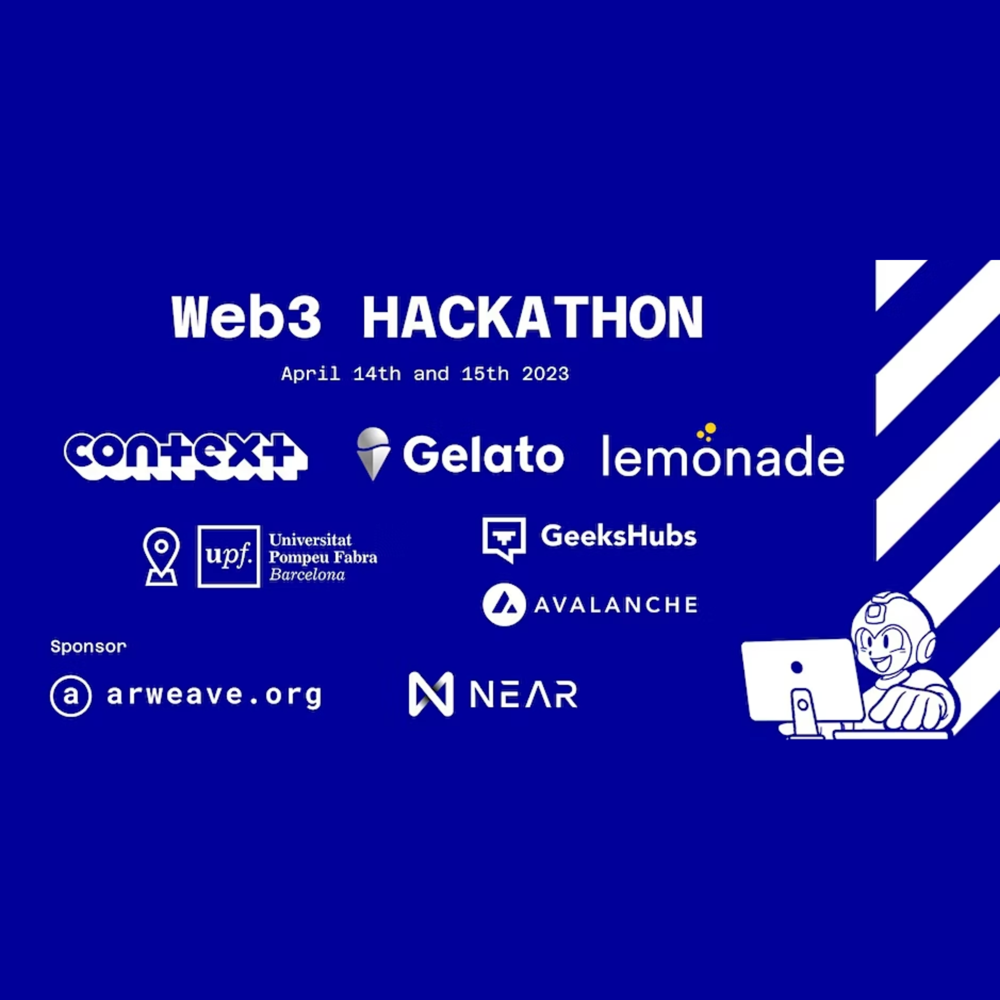

# context


**Context**, a [hackathon winner](#web3-hackathon-winners) `MVP` for storing and
verifying certifications using blockchain technology. Organizations can issue
tamper-proof digital certificates that can be easily verified by third parties.

- `Secure` storage of certifications
- Easy verification of certifications by `third` parties
- Customizable certificate `templates` for different types of certifications
- Built-in fraud `prevention` measures to prevent certificate tampering

# getting started

Clone the repo:

```sh
git clone git@github.com:Jabolol/context.git .
```

Run the development server:

```sh
npm run dev
# or
yarn dev
# or
pnpm dev
```

Check out the result:

```
https://localhost:3000/
```

# Web3 hackathon winners

> Presential Hackathon in Barcelona April `14th` & `15th` 2023 at `Barcelona`.

Over the course of two days our team, integrated by
[xRozzo](https://github.com/xRozzo),
[Alex Alra Arteaga](https://github.com/alex-alra-arteaga) and
[Jabolol](https://github.com/Jabolol), designed and created this idea, rising to
the highest ranking.

We are thrilled to have had the opportunity to showcase our skills and
contribute to the growth of the `web3` ecosystem. This hackathon was a great
experience for our team, and we look forward to participating in future web3
events and continuing to develop `innovative` solutions using these cutting-edge
technologies.


